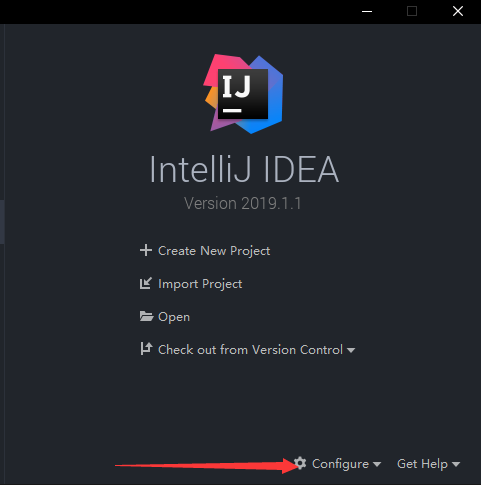
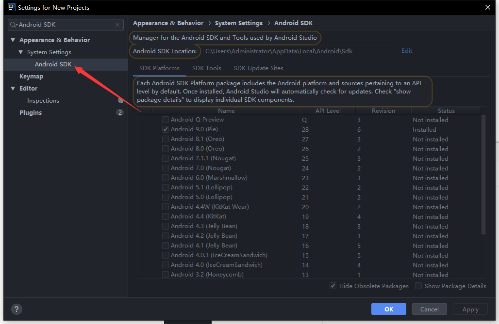
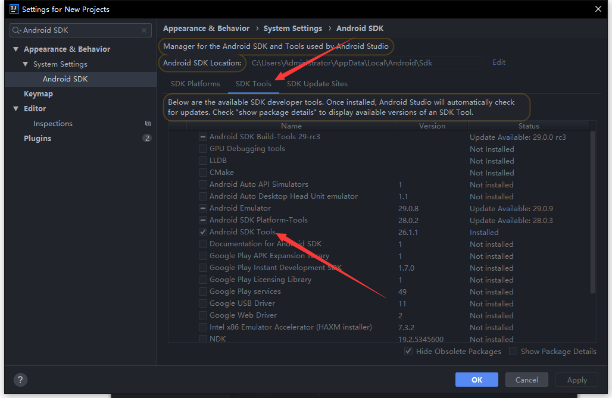
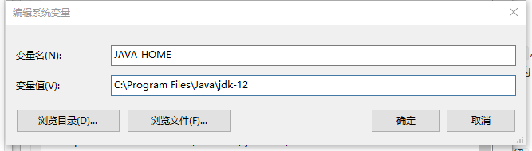
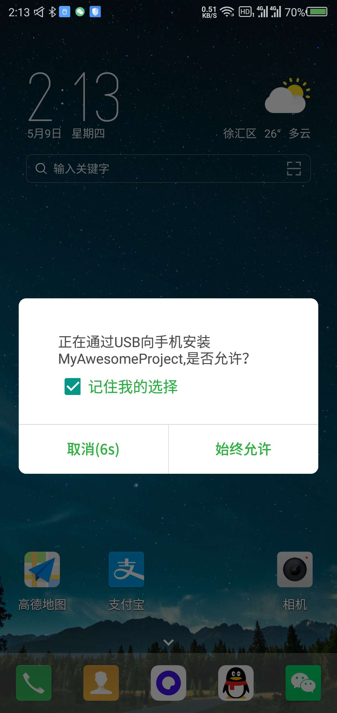
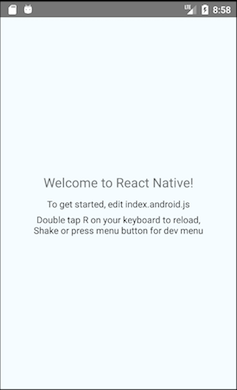
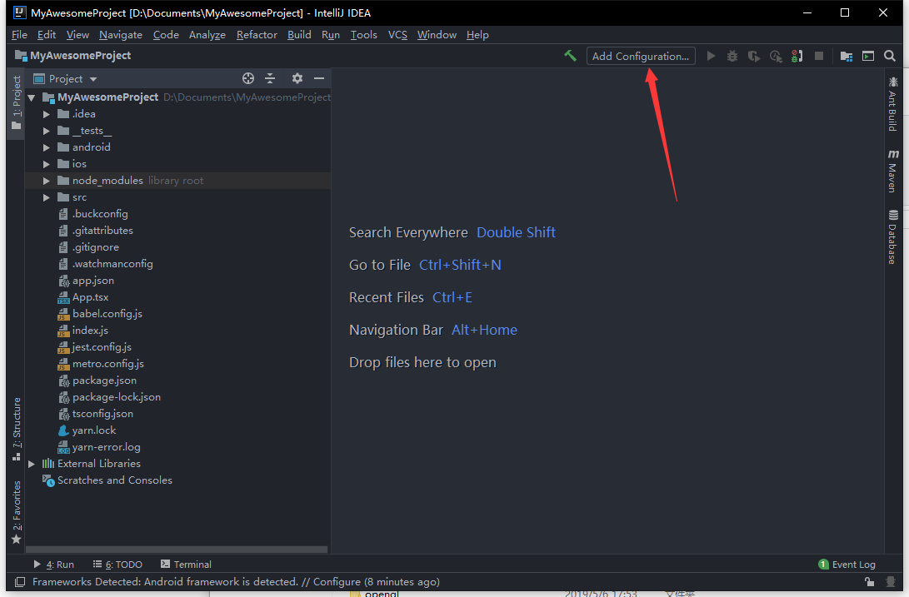
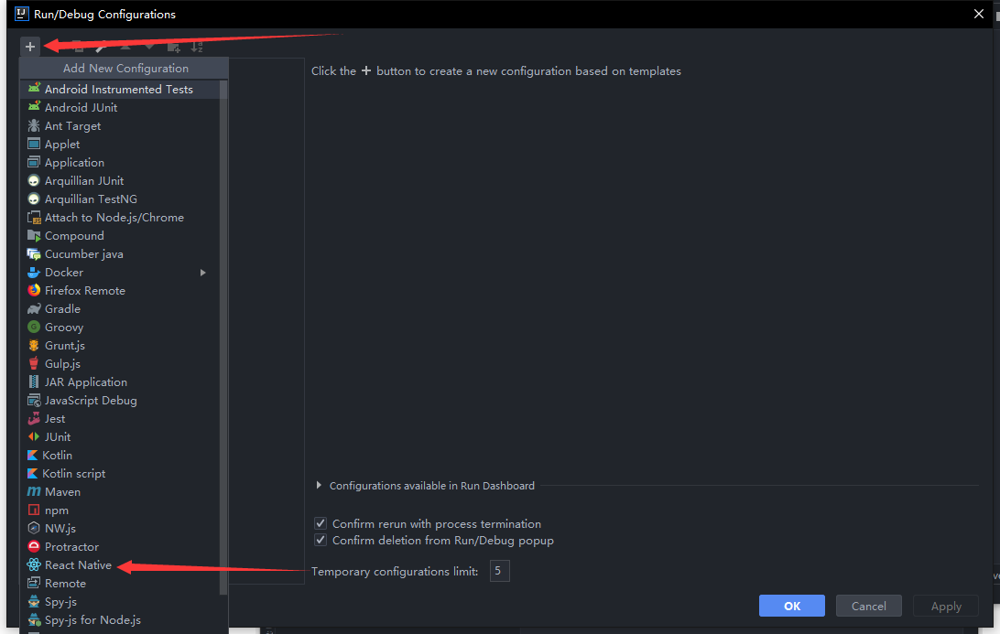
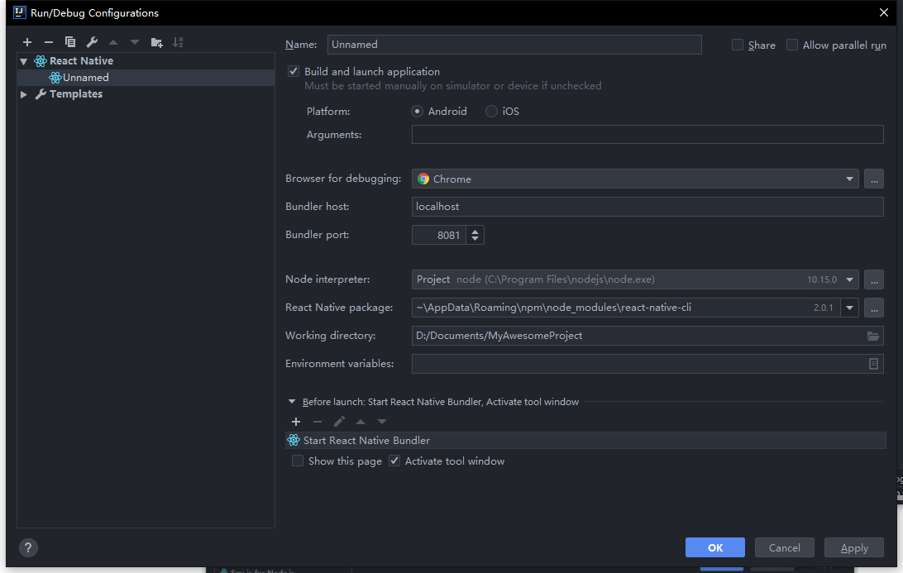
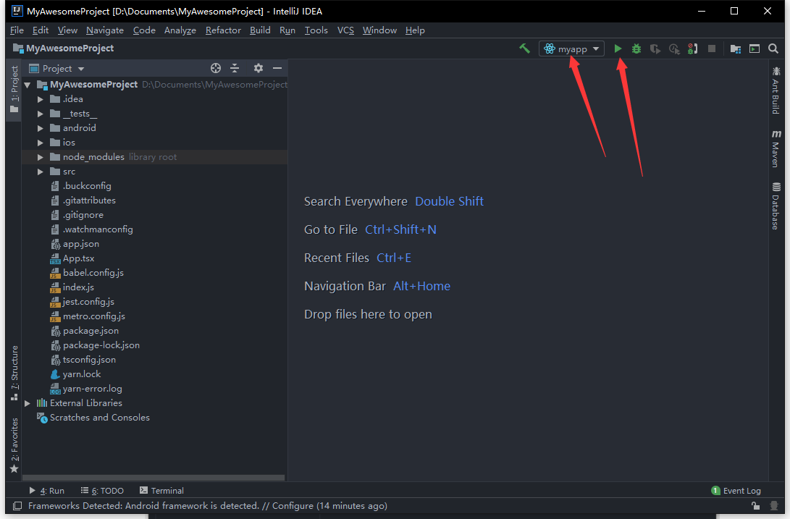

# 搭建 React Native 项目

注：windows 下只可以进行 Android 开发，IOS 只能在 macos 下进行开发，所以以下教程针对 windows 下的 Android 开发

### 安装依赖

必须安装的依赖：Node，React Native 命令行工具，Python2，还有 JDK 和 Android SDK。

IDE 建议使用 IntelliJ IDEA 开发原生组件，vscode 开发 React 相关的 ts 组件（也可以用 IDEA 来写 ts，随个人习惯）。

Nodejs 下载地址：[https://npm.taobao.org/mirrors/node/v10.15.3/node-v10.15.3-x64.msi](https://npm.taobao.org/mirrors/node/v10.15.3/node-v10.15.3-x64.msi)

Python2.7 下载地址：[https://www.python.org/ftp/python/2.7.15/python-2.7.15.amd64.msi](https://www.python.org/ftp/python/2.7.15/python-2.7.15.amd64.msi)

JDK：[https://download.oracle.com/otn-pub/java/jdk/12.0.1+12/69cfe15208a647278a19ef0990eea691/jdk-12.0.1\_windows-x64\_bin.exe](https://download.oracle.com/otn-pub/java/jdk/12.0.1+12/69cfe15208a647278a19ef0990eea691/jdk-12.0.1_windows-x64_bin.exe)

IDEA 下载地址：[https://download.jetbrains.com/idea/ideaIU-2019.1.2.exe](https://download.jetbrains.com/idea/ideaIU-2019.1.2.exe)

React Native 命令行工具需要使用 npm 或者 yarn 安装，建议使用 yarn 来安装，具体命令：

```bash
# 由于Facebook有些镜像被墙，可以设置淘宝镜像源
npm config set registry https://registry.npm.taobao.org --global
npm config set disturl https://npm.taobao.org/dist --global
​
# 全局安装yarn和React Native命令行工具（react-native-cli）
npm install -g yarn react-native-cli
​
# 设置yarn淘宝镜像源
yarn config set registry https://registry.npm.taobao.org --global
yarn config set disturl https://npm.taobao.org/dist --global
​
# 接下来就可以用yarn替代npm了，例如：
# yarn add @ant-design/react-native
```

#### Android 开发环境搭建

1. 打开安装好的 IDEA，注册码可以到[这里](http://idea.lanyus.com/)获取。
2. 点击 Configure，点击 Settings，打开 Settings 界面

   

3. 搜索框中输入`Android SDK`，选择你的 Android SDK，如果还没有安装 Android SDK，可以选择一个版本进行下载安装。

   

4. 切换到`SDK Tools`,选择`Android SDK Tools`，然后安装，最后点击右下角的`Apply`按钮

   

5. 现在，我们需要配置`JAVA_HOME`和`ANDROID_HOME` 环境变量

打开`控制面板` -&gt; `系统和安全` -&gt; `系统` -&gt; `高级系统设置` -&gt; `高级` -&gt; `环境变量` -&gt; `新建`，创建一个名为`JAVA_HOME`的环境变量（系统或用户变量均可），指向你的 JDK 所在的目录（具体的路径可能和下图不一致，请自行确认）： 



 打开`控制面板` -&gt; `系统和安全` -&gt; `系统` -&gt; `高级系统设置` -&gt; `高级` -&gt; `环境变量` -&gt; `新建`，创建一个名为`ANDROID_HOME`的环境变量（系统或用户变量均可），指向你的 Android SDK 所在的目录（具体的路径可能和下图不一致，请自行确认）：


 SDK 默认是安装在下面的目录：

```text
  c:\Users\你的用户名\AppData\Local\Android\Sdk
```

 你可以在 IDEA 的"Preferences"菜单中查看 SDK 的真实路径，具体是**Appearance & Behavior** → **System Settings** → **Android SDK**。 你需要关闭现有的命令符提示窗口然后重新打开，这样新的环境变量才能生效。

1. 接下来把 jdk 的 bin 目录和 platform-tools 目录添加到环境变量 Path 中

打开`控制面板` -&gt; `系统和安全` -&gt; `系统` -&gt; `高级系统设置` -&gt; `高级` -&gt; `环境变量`，选中**Path**变量，然后点击**编辑**。点击**新建**然后把 jdk 的 bin 目录和 platform-tools 目录路径添加进去。

jdk 的 bin 目录的默认路径为：

```text
C:\Program Files\Java\jdk-12\bin
```

platform-tools 目录的默认路径为：

```text
c:\Users\你的用户名\AppData\Local\Android\Sdk\platform-tools
```

#### IOS 开发环境搭建

由于我是使用 windows 的，所以本部分文档请参考[https://reactnative.cn/docs/getting-started.html\#xcode](https://reactnative.cn/docs/getting-started.html#xcode)

### 创建项目

使用 React Native 命令行工具来创建一个基于 typescript 开发环境的名为"myapp"的新项目：

```text
react-native init myapp --template typescript
```

#### 准备 Android 设备

你需要准备一台 Android 设备来运行 React Native Android 应用。这里所指的设备既可以是真机，也可以是模拟器。

我们目前使用 Android 真机来进行开发，需要我们的 Android 设备连接到电脑，然后打开 USB 调试。

### 编译并运行 React Native 应用

确保你先运行了模拟器或者连接了真机，然后在你的项目目录中运行`react-native run-android`：

```text
cd myapp
react-native run-android
```

如果配置没有问题，你应该可以看到应用自动安装到设备上并开始运行。

> 注意：手机可能会弹出`正在通过USB向手机安装myapp，是否允许？`弹窗，请选择允许



注意第一次运行时需要下载大量编译依赖，耗时可能数十分钟。此过程`严重依赖稳定的翻墙工具`，否则将频繁遭遇链接超时和断开，导致无法运行。

出现下图界面，表示我们的 React Native 项目已经运行成功。



#### 使用 IDEA 运行 React Native 应用

使用 IDEA 打开我们的`myapp`文件夹，点击图下箭头所示的`Add Configuration...`按钮



打开 Run/Debug Configurations 界面，点击`+`按钮，选择下面列表中的`React Native`



在 Name 中可以输入这个运行配置的名称，然后点击右下角的`Apply`按钮，就完成了。



接下来就可以点击这个绿色的小三角运行 React Navite 应用了。



### 集成 redux、react-router-native 到 React Native 应用中

#### 安装依赖

```bash
yarn add redux react-redux react-router-native connected-react-router @types/react-redux @types/react-router-native @types/redux
```

#### 改造 App.tsx

```jsx
...
// 引入
import { Provider } from 'react-redux'
import { ConnectedRouter, connectRouter } from 'connected-react-router'
import { combineReducers, createStore } from 'redux'
import { createMemoryHistory } from 'history'
import {  Route, Link, Switch } from 'react-router-native'
​
// 你自己的reducer
import reducers from './src/reducers'
​
// 声明history，rootReducer，store
export const reduxHistory = createMemoryHistory()
const rootReducer = combineReducers({
    router: connectRouter(reduxHistory),
  ...reducers
})
const store = createStore(rootReducer, undefined)
​
...
const Home = () => <Text style={{}}>Home</Text>
const About = () => <Text style={{}}>About</Text>
​
​
export default class App extends Component<Props> {
  render() {
    return (
        <Provider store={store}>
            <ConnectedRouter history={reduxHistory}>
              <View>
                <Switch>
                  <Route exact path="/" component={Home} />
                  <Route exact path="/about" component={About} />
                </Switch>
              </View>
            </ConnectedRouter>
        </Provider>)
    }
}
```

至此，React Native 应用已经集成了 Redux，React Router。

