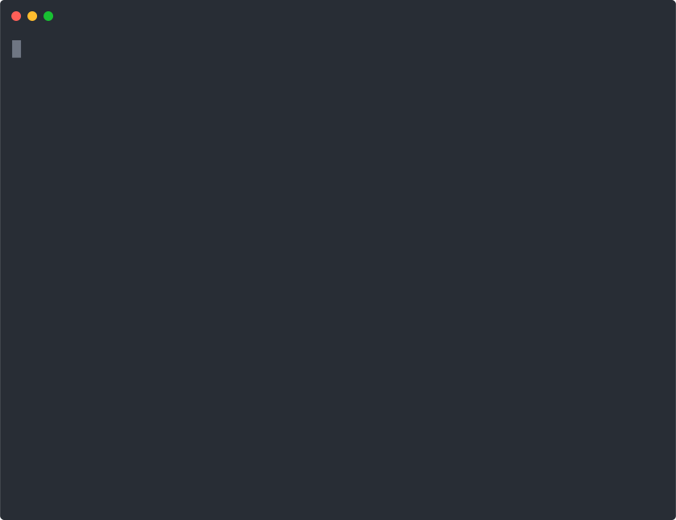
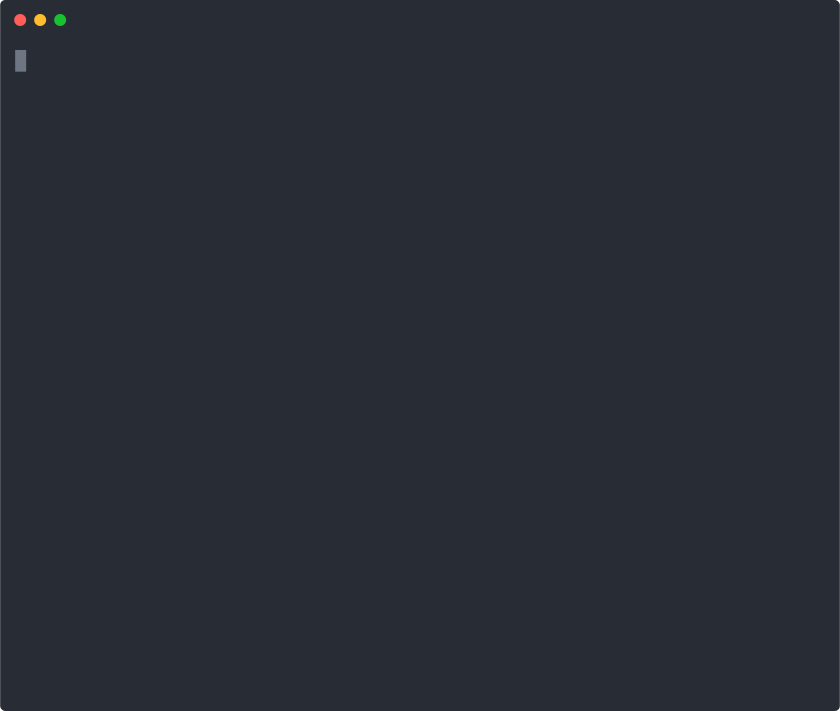

# 搭建 React 项目

## 从零开始创建 React 项目

上篇文档已经简单介绍了 react 风格的 tsx 代码，本篇文档主要讲述如何创建一个 React 项目进行工作。

创建 react 项目，本文档会介绍两种运行 react 应用的方式：

1. 我们可以使用上篇文档 demo 中所使用的 babel 来运行 react 应用。
2. 我们可以使用 Facebook 提供的 create-react-app 脚手架来创建 react 项目，然后用 cli 来运行 react 应用。

> 注：电脑上需要有 nodejs 和 npm 运行环境

### Babel 运行 React 应用

这种 Babel 运行 react 应用的方式，是我们主要用来写 demo 或者学习 react 入门使用的方式。

#### 步骤

1. 新建一个文件夹，打开命令行工具
2. 输入`npm init`命令，一路回车
3.  安装 http-server，用于启动本地服务器\
    &#x20;&#x20;

    
4.  安装`react`，`react-dom `&#x20;

    
5.  新建`index.html`：

    ```
    <html>
      <head>
        <meta charset="UTF-8" />
        <title>Hello World</title>
        <!--引入react及react-dom-->
        <script src="./node_modules/react/umd/react.development.js"></script>
        <script src="./node_modules/react-dom/umd/react-dom.development.js"></script>
        <!--引入babel在线翻译器-->
        <script src="https://unpkg.com/babel-standalone@6.15.0/babel.min.js"></script>
        <!--我们自己写的jsx组件-->
        <script type="text/babel" src="./demo.jsx"></script>
      </head>
      <body>
        <div id="app"></div>
        <script type="text/babel">
          window.onload = () => {
            ReactDOM.render(<List />, document.getElementById("app"));
          };
        </script>
      </body>
    </html>
    ```
6.  新建`demo.jsx`：

    ```
    const Todo = ({ label, del }) => {
      //无状态组件，只用于展示
      //label, del为props属性，无法被修改
      return (
        <div className="todo-item">
          {label} <button onClick={del}>删除</button>
        </div>
      );
    };
    ​
    class List extends React.Component {
      //class有状态组件
      state = {
        //声明并初始化state
        labelInput: "",
        searchInput: "",
        list: []
      };
    ​
      add = () => {
        //增加方法
        const { list, labelInput } = this.state;
        list.push({ label: labelInput });
        this.setState({ list });
      };
      del = index => {
        //删除方法
        const { list } = this.state;
        list.splice(index, 1);
        this.setState({ list });
      };
      render() {
        //渲染方法
        const { add, del } = this;
        const { list, labelInput, searchInput } = this.state;
        return (
          <div>
            <h1>Todo List</h1>
            {
              //单向数据流
            }
            <input
              type="text"
              value={labelInput}
              onChange={e => this.setState({ labelInput: e.target.value })}
            />
            <button onClick={add}>增加</button>
            <input
              type="text"
              value={searchInput}
              onChange={e => this.setState({ searchInput: e.target.value })}
              placeholder="输入查询"
            />
            {list
              .filter(({ label }) => label.indexOf(searchInput) !== -1)
              .map((v, index) => (
                <Todo key={index} del={() => del(index)} {...v} />
              ))}
          </div>
        );
      }
    }
    ```
7. 命令行输入`http-server`，启动服务器
8. 浏览器打开[http://localhost:8080/](http://localhost:8080)，查看我们的react应用

### create-react-app 搭建 React 应用

这个脚手架是用 webpack 来加载 react 应用的，通常我们在开发项目中主要会使用脚手架来搭建并运行部署 react 项目。

#### 步骤

```
yarn create react-app my-app --typescript
​
cd my-app
​
yarn start
```

打开浏览器访问[http://localhost:3000/](http://localhost:3000)，就可以看到，我们的react应用已经开始运行了。
